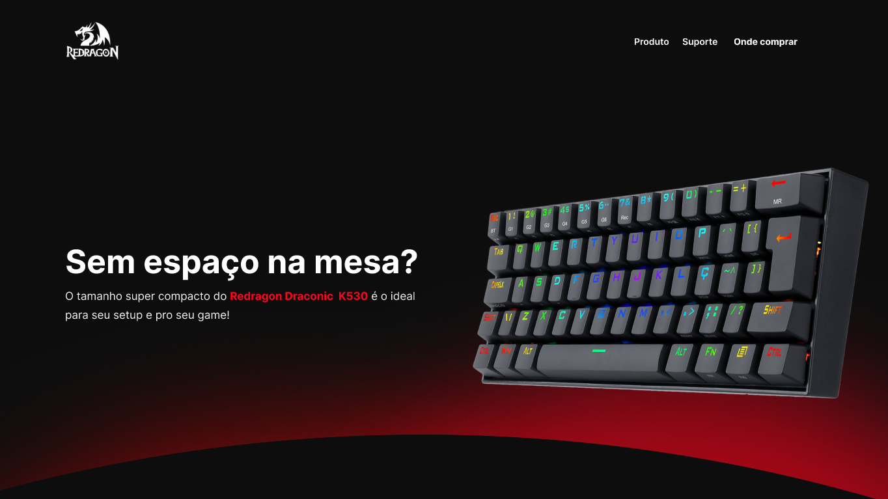
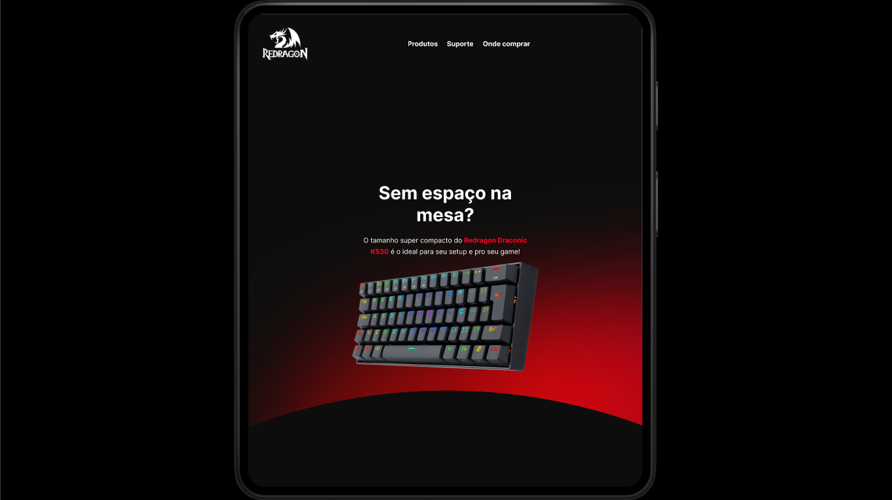

<h1 align="center" style="font-weight: bold;">Landing Page - Redragon ⌨️</h1>

<p align="center">
  <a href="#objective">Objetivo</a> • 
  <a href="#tech">Tecnologias</a> • 
  <a href="#started">Começando</a> • 
  <a href="#credits">Créditos</a> • 
</p>

<p align="center">
    <b>Landing Page do teclado Redragon Draconic K530</b>
</p>

<p align="center">
     <a href="#">🚦 Projeto</a>
     <a href="https://www.figma.com/community/file/1567348884716242526">🚧 Figma</a>
</p>

<h2 id="layout">🎨 Visão da página</h2>

<p align="center">
    
    
</p>

<h2 id="objective">💡 | Objetivo</h2>

Esta página visa induzir o usuário a comprar um produto, o **teclado Draconic K530** da **Redragon**.
<br> <br>
O intuito deste projeto é aplicar conhecimentos técnicos de **UI/UX** com o Figma, arquitetando a página e visando responsividade. 

Possuindo as seguintes competências:

- Arquitetura organizada de arquivos internos.
- Tags semânticas visando SEO.
- Imagens responsivas.
- Media Queries.
<br> <br>

<h2 id="technologies">💻 | Tecnologias</h2>
  
  
  <br>

<h2 id="started">🚀 | Começando</h2>

Quer rodar este projeto localmente? Aqui está sua solução!

<h3>Clonando</h3>

Como clonar este projeto:

```bash
git clone https://github.com/isacarrd/redragon-draconic
```

<br> <br>

<h2  align="center" style="font-weight: bold;" id="credits"> Todos os direitos reservados &copy; <a href="https://www.redragon.com.br/">REDRAGON</a>.</h2>
